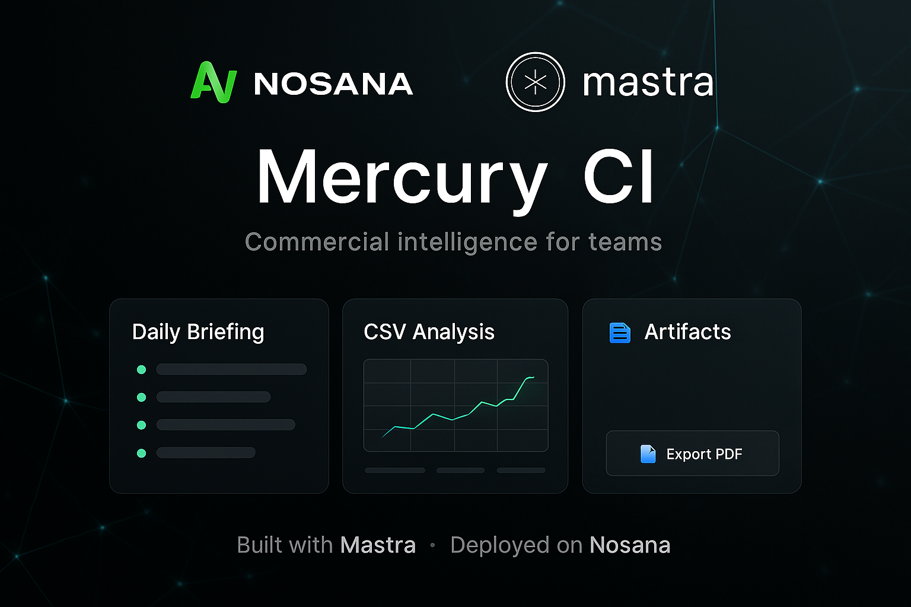

# Mercury CI - Commercial Intelligence Platform
**AI-powered commercial intelligence for teams**

[](LICENSE) 
[](https://www.typescriptlang.org/) 
[](https://nextjs.org/) 
[](https://www.docker.com/)

*Transforming raw data into actionable intelligence through AI-powered automation.*

<p align="center">
  
</p>

## Welcome to Mercury CI

Mercury CI is an AI-powered commercial intelligence platform that helps teams generate daily briefings, analyse CSV data, and create actionable business insights. Built with the **Mastra framework** and deployed on the **Nosana decentralised compute network**.

**Default provider: OpenAI.** For challenge verification, set `OLLAMA_API_URL` to the shared Nosana endpoint or local Ollama.

## 🏗️ Architecture

```
Next.js UI → Mastra Agent → Provider (OpenAI | Ollama | Nosana)
```

*(Mercury CI's architecture showing the flow between the Next.js frontend, Mastra agent backend, and provider models)*

## 🎯 Platform Overview

**Mission:** Transform raw data into actionable intelligence through AI-powered analysis and automated reporting.

### Key Features

Mercury CI provides intelligent business analysis through:
- **Daily Intelligence Briefings** - Automated market and business insights
- **CSV Data Analysis** - Upload and analyse business data with AI insights
- **Automated Reporting** - Generate comprehensive reports and exports
- **Natural Language Queries** - Ask questions about your data in plain English
- **Memory System** - Learns from your preferences and gets smarter over time

### Technology Stack

Mercury CI is built with modern technologies:
- **Mastra Framework** - AI agent orchestration and management
- **CopilotKit** - Natural language chat interface
- **Next.js** - React-based frontend framework
- **OpenAI GPT-4o** - Advanced language model for intelligence
- **Docker** - Containerised deployment
- **Nosana Network** - Decentralised compute infrastructure

## Getting Started

### Quick Start with Docker Compose

The fastest way to get Mercury CI running:

```bash
# Clone the repository
git clone https://github.com/mtb-io/nos-agent-challenge.git
cd nos-agent-challenge

# Set up environment variables
cp .env.example .env
# Edit .env with your API keys

# Start with Docker Compose
docker compose up --build

# Access Mercury CI at http://localhost:3000
```

### Prerequisites

To run Mercury CI locally, you'll need:

- **Node.js** 18+ and **pnpm**
- **Docker** and **Docker Compose**
- **OpenAI API Key** (for AI functionality)
- **Git** for cloning the repository

### Development Setup

#### **Step 1: Clone and Setup**

```bash
# Clone the repository
git clone https://github.com/mtb-io/nos-agent-challenge.git
cd nos-agent-challenge

# Copy environment file
cp .env.example .env

# Install dependencies
pnpm install

# Start development servers
pnpm run dev:ui      # Start UI server (port 3000)
pnpm run dev:agent   # Start Mastra agent server (port 4111)
```

Open <http://localhost:3000> to see Mercury CI in action.
Open <http://localhost:4111> to access the Mastra Agent Playground.

#### **Step 2: Choose Your LLM for Development (Optional)**

Pick one option below to power your agent during development:

##### Option A: Use Shared Nosana LLM Endpoint (Recommended - No Setup!)

We provide a free LLM endpoint hosted on Nosana for development. Edit your `.env`:

```env
# Qwen3:8b - Nosana Endpoint
# Note baseURL for Ollama needs to be appended with `/api`
OLLAMA_API_URL=https://3yt39qx97wc9hqwwmylrphi4jsxrngjzxnjakkybnxbw.node.k8s.prd.nos.ci/api
MODEL_NAME_AT_ENDPOINT=qwen3:8b
```

**⚠️ If this shared endpoint returns HTML "Faithfully yours, frp.", use Option C (OpenAI) or Option B (local Ollama).**

##### Option B: Use Local LLM

Run Ollama locally (requires [Ollama installed](https://ollama.com/download)):

```bash
ollama pull qwen3:0.6b
ollama serve
```

Edit your `.env`:
```env
OLLAMA_API_URL=http://127.0.0.1:11434/api
MODEL_NAME_AT_ENDPOINT=qwen3:0.6b
```

##### Option C: Use OpenAI

Add to your `.env` and uncomment the OpenAI line in `src/mastra/agents/index.ts`:

```env
OPENAI_API_KEY=your-key-here
```

(Recommended for stability and development speed)

## 🔧 Troubleshooting

- **HTML "Faithfully yours, frp."** → your Nosana node isn't bound; switch to OpenAI or local Ollama.
- **Docker build takes ages** → ensure `.dockerignore` excludes `.next`, `node_modules`; run `pnpm install` outside Docker for dev.
- **401 from OpenAI** → check `OPENAI_API_KEY` in `.env`.

## 🚀 Deployment

### Docker Compose (Recommended)

```bash
# Build and start Mercury CI with Docker Compose
docker compose up --build

# Stop the services
docker compose down

# View logs
docker compose logs -f
```

### Manual Docker Commands

```bash
# Build your container
docker build -t mtb-io/nos-agent-challenge:latest .

# Test locally
docker run -p 3000:3000 -p 4111:4111 mtb-io/nos-agent-challenge:latest 

# Push to Docker Hub
docker login
docker push mtb-io/nos-agent-challenge:latest
```

### Docker Compose Configuration

The included `docker-compose.yml` provides:
- **Frontend**: Next.js app on port 3000
- **Backend**: Mastra agent API on port 4111
- **Environment**: Automatic `.env` file loading
- **Networking**: Internal service communication

## ✅ Mercury CI Features

Current implementation includes:

- [x] **Mercury CI Agent** - Commercial intelligence assistant with OpenAI integration
- [x] **Modern UI** - Three-tab interface (Briefing, Data, Artifacts) with animations
- [x] **Docker Support** - Complete containerisation with Docker Compose
- [x] **British English** - Proper UK spelling and date formats throughout
- [x] **MIT License** - Open source distribution
- [x] **Comprehensive Documentation** - Setup and deployment instructions
- [ ] **Google OAuth** - User authentication (planned)
- [ ] **CSV Analysis** - Real data processing (planned)
- [ ] **Report Generation** - Automated PDF/Excel exports (planned)

## 🚀 Next Steps

### Phase 1: Core Functionality (Current)
- ✅ Mercury CI UI and branding
- ✅ Docker Compose setup
- ✅ OpenAI integration
- ✅ Basic agent configuration

### Phase 2: Data Integration (Planned)
- 🔄 Google OAuth authentication
- 🔄 Gmail/Calendar API integration
- 🔄 CSV file upload and analysis
- 🔄 Real-time data collection

### Phase 3: Advanced Features (Future)
- 🔄 Automated report generation
- 🔄 Advanced analytics and insights
- 🔄 Multi-user collaboration
- 🔄 Nosana deployment

## 🏆 Challenge Compatibility

This project can be evaluated using the shared Nosana LLM endpoint or any local Ollama setup. OpenAI is used for stable development and demonstration.

## 🚀 Deploying to Nosana

### Using Nosana Dashboard
1. Open [Nosana Dashboard](https://dashboard.nosana.com/deploy)
2. Click `Expand` to open the job definition editor
3. Edit `nos_job_def/nosana_mastra.json` with your Docker image:
   ```json
   {
     "image": "mtb-io/nos-agent-challenge:latest"
   }
   ```
4. Copy and paste the edited job definition
5. Select a GPU
6. Click `Deploy Job`

### Using Nosana CLI (Alternative)
```bash
npm install -g @nosana/cli
nosana job post --file ./nos_job_def/nosana_mastra.json --market nvidia-3090 --timeout 30
```

## 📚 Resources

For more information, check out the following resources:

- [Nosana Documentation](https://docs.nosana.io)
- [Mastra Documentation](https://mastra.ai/docs) - Learn more about Mastra and its features
- [CopilotKit Documentation](https://docs.copilotkit.ai) - Explore CopilotKit's capabilities
- [Next.js Documentation](https://nextjs.org/docs) - Learn about Next.js features and API
- [Docker Documentation](https://docs.docker.com)
- [Nosana CLI](https://github.com/nosana-ci/nosana-cli)
- [Mastra Agents Overview](https://mastra.ai/docs/agents/overview)
- [Build an AI Stock Agent Guide](https://mastra.ai/guides/stock-agent)
- [Mastra Tool Calling Documentation](https://mastra.ai/docs/agents/tools)

## 🆘 Support & Community

### Get Help
- **Discord**: Join [Nosana Discord](https://discord.gg/nosana) 
- **X (Twitter)**: Follow [@nosana_ai](https://x.com/nosana_ai) for live updates

## 📄 License

This project is licensed under the MIT License - see the [LICENSE](LICENSE) file for details.

---

**Mercury CI** - Commercial Intelligence for Teams  
Built with ❤️ by [mtb labs](https://github.com/mtb-io)

*Transforming raw data into actionable intelligence through AI-powered automation.*